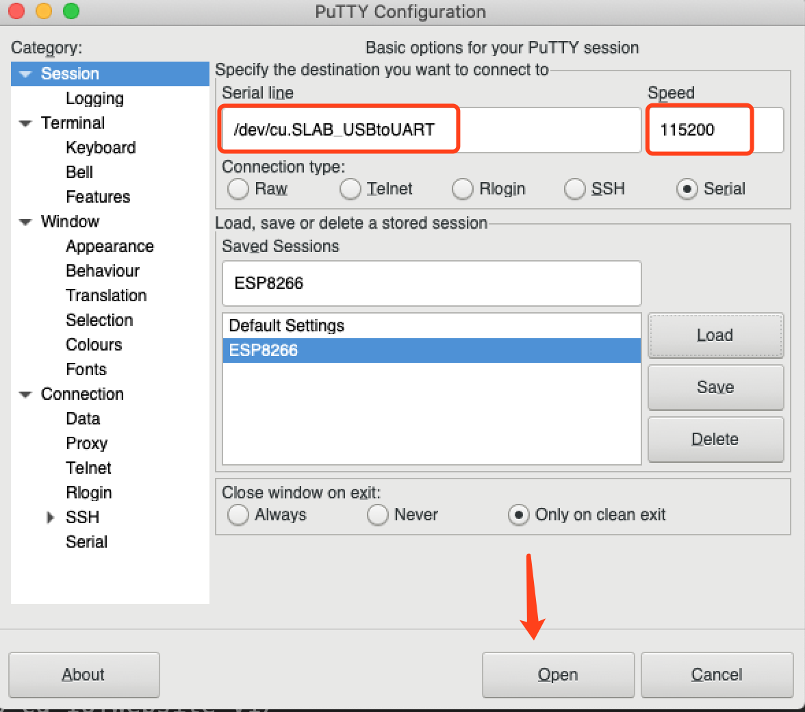

# ESP8266+MicroPython

### 工具（MAC）

windows这方面的工具应该更多

ITerm     PuTTY     Python3

### 下载MicroPython固件

[下载地址](http://micropython.org/download#esp8266)

### 下载需要的Py库

```bash
pip install esptool
```

### 写入[MicroPython](http://docs.micropython.org/en/latest/esp8266/quickref.html)固件

刷入之前建议先擦除一下，否则可能会出现错误

```bash
#/dev/cu.SLAB_USBtoUART 为你的单片机连接至电脑的端口编号
esptool.py --port /dev/cu.SLAB_USBtoUART erase_flash
```

写入MicroPython

```bash
#这里的115200为波特率 如果设置太大会有问题
esptool.py --port /dev/cu.SLAB_USBtoUART --baud 115200 write_flash --flash_size=detect 0 esp8266-20180511-v1.9.4.bin
```

之后会出现一个MicroPython-xxxxxx的热点，如果没有可以重启一下开发板，密码为【micropythoN】

### 开发

1. 打开PuTTY



之后会打开一个控制台，就可以运行Py脚本了

运行命令安装模块并根据提示设置

```text
import webrepl_setup
```

下载[REPL](http://micropython.org/webrepl)

解压并打开 webrepl

点击连接，输入密码，成功后即可开始编程

### 尝试点亮一盏灯

```python
>>> import machine    #必要的模块
>>> pin = machine.Pin(2, machine.Pin.OUT)    #获取LED引脚
>>> pin.on()    #关灯
>>> pin.off()     #开灯

>>> import port_diag   #查看ESP8266信息
```

### 开发

安装模块

```python
pip install adafruit-ampy
```

查看ESP8266中的文件

```python
ampy --port /dev/cu.SLAB_USBtoUART ls
```

本地新建文件 main.py 开始编写程序，ESP8266默认会执行 main.py 

```python
import machine
import time


# 闪烁指示灯
def blink():
    led = machine.Pin(2, machine.Pin.OUT)
    led.off()
    while True:
        led.on()
        time.sleep(0.5)
        led.off()
        time.sleep(0.5)
        print('blink....')


# 连接WiFi
def netClient():
    import network
    wlan = network.WLAN(network.STA_IF) # create station interface
    wlan.active(True)       # activate the interface
    wlan.scan()             # scan for access points
    wlan.isconnected()  # check if the station is connected to an AP
    if not wlan.isconnected():
        print('connecting to network...')
        wlan.connect('这里填写要连接的WiFi名称', 'WiFi密码') # connect to an AP
        while not wlan.isconnected():
            pass
    print('network config:', wlan.ifconfig())
    s = wlan.config('mac')  # get the interface's MAC adddress

    ap = network.WLAN(network.AP_IF) # create access-point interface
    ap.active(True)         # activate the interface
    ap.config(essid='ESP-AP') # 开启一个热点
    blink()


netClient()
```

### 结语

之后可以用Node.js或其他语言，也可以使用其他的IOT云平台进行与ESP8266的通信，建议使用MQTT协议，外围设备根据自己喜好进行设计开发。


