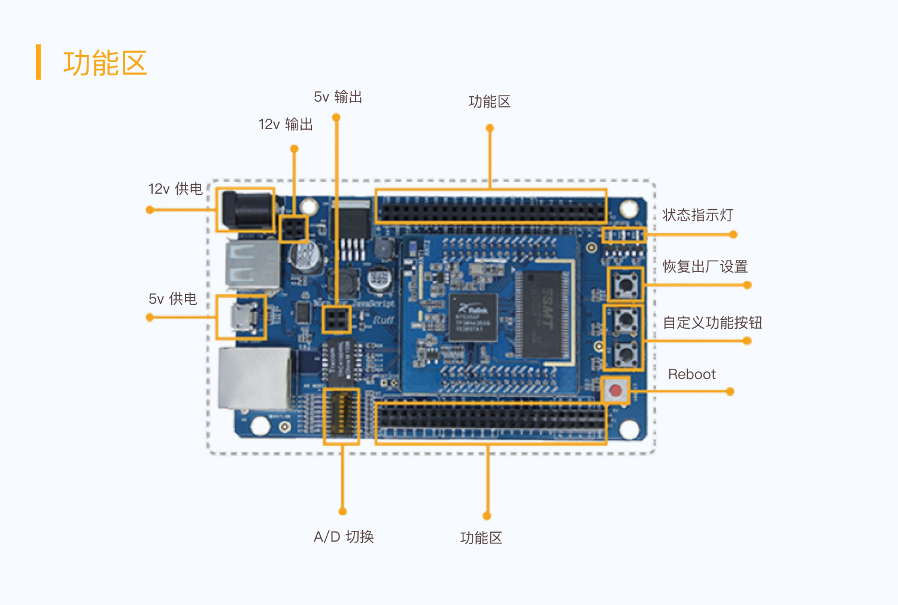

# Ruff


### Ruff初见

#### 检查版本

rap --version

#### 创建 “Hello Ruff” 项目

```javascript
# 新建项目文件夹
mkdir hello-ruff
# 进入项目文件夹
cd hello-ruff
# 初始化 Ruff 应用
rap init
```



### 第二步

连接开发板的热点

### 查看固件版本

```javascript
rap system info 192.168.78.1
```

### 添加外设

```text
sudo rap device add button
```

### 线路展示

```text
rap layout
```

### 部署并重启应用

```javascript
rap deploy -s
```

### 查看控制台日志

```javascript
rap log
```

### 基本写法

```javascript
'use strict';

var http = require('http');
var NetConfig = require('./NetConfig/index.js');
var IOT = require('./aliIOT/index.js');


$.ready(function (error) {

    if (error) {
        console.log(error);
        return;
    }

    IOT.listen()

    $('#button').on('push', function () {
        console.log('Button pushed.');
		    IOT.send('I will be strong!!!!')
        
        $('#led-r').turnOn();
    });


     // 在 `#button` 释放时熄灭 `#led-r`.
    $('#button').on('release', function () {
        console.log('Button released.');
        $('#led-r').turnOff();
    });
});

$.end(function () {
    $('#led-r').turnOff();
});

```

