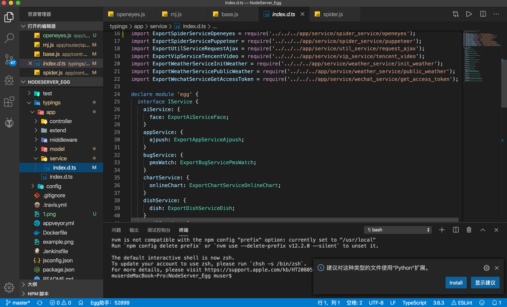

# 基本开发须知

### csrf

关闭方法

```javascript
//{app_root} / config / config.default.js
config.security = {
    csrf: {
        enable: false,
    },
};
```

### 配置跨域

1. 安装插件

```bash
npm i egg-cors --save
```

2. 挂载插件

```javascript
// {app_root}/config/plugin.js
exports.cors = {
  enable: true,
  package: 'egg-cors',
};
```

3. 配置插件

```javascript
config.security = {
    // 关闭 csrf
    csrf: {
      enable: false,
    },
     // 跨域白名单
    domainWhiteList: [ 'http://localhost:3000' ],
  };
  // 允许跨域的方法
  config.cors = {
    origin: '*',
    allowMethods: 'GET, PUT, POST, DELETE, PATCH'
  };
```

### 路由版本控制

1. 安装[依赖](https://github.com/eggjs/egg-router-plus)

```bash
cnpm i -S egg-router-plus 
```

   2. 插件配置

```javascript
// {app_root}/config/plugin.js
exports.routerPlus = {
  enable: true,
  package: 'egg-router-plus',
};
```

   3.插件使用

```javascript
module.exports =  app  => {

    const { router, controller } = app;
    
    const apiV1Router = router.namespace('/api/v1')

    apiV1Router.post('/home', controller.home.index)

};
```

### 获取get请求参数

```javascript
this.ctx.query.id
```

### 获取post请求参数

```javascript
this.ctx.request.body.id
```

#### 如果无法确定服务方法等参数，可以看一下这里




