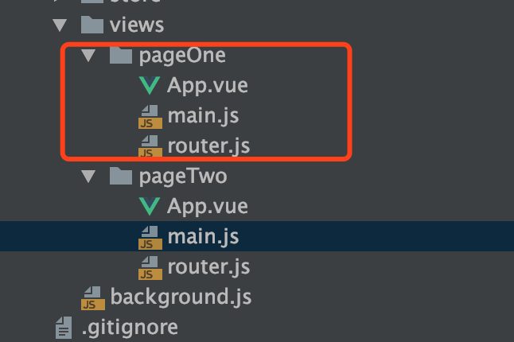

# Vue CLI Plugin Electron Builder

[官方文档](https://nklayman.github.io/vue-cli-plugin-electron-builder/?utm_source=wechat_session&utm_medium=social&utm_oi=835231260258492416)


请提前安装vue cli 3.+


### 起手式-新建项目

```text
vue create easy-step
# 进入项目目录
cd easy-step
```

### 依赖安装

```bash
vue add electron-builder
#选择最新的Electron Version 这里选择了6.0.0
```

### 运行

```text
npm run electron:serve
```

### 打包构建

```bash
npm run electron:build
```

打包后会生成一个新目录dist\_electron，这里存放着构建出来的安装包

### 多页应用

以前使用的electron-vue，打开第二窗口简直堪称恶心，现在这种虽然配置起来有些坑，不会总体来说还是好实现的。

当前目录结构


修改目录结构



注意修改 main.js 的引用

在 package.json 同级目录下创建 vue.config.js

```javascript
// vue.config.js
module.exports = {
    pages: {
        pageOne: {
            // 应用入口配置，相当于单页面应用的main.js，必需项
            entry: 'src/views/pageOne/main.js',

            // 应用的模版，相当于单页面应用的public/index.html，可选项，省略时默认与模块名一致
            template: 'public/index.html',

            // 编译后在dist目录的输出文件名，可选项，省略时默认与模块名一致
            filename: 'index.html',

            // 标题，可选项，一般情况不使用，通常是在路由切换时设置title
            // 需要注意的是使用title属性template 中的 title 标签需要是 <title><%= htmlWebpackPlugin.options.title %></title>
            title: 'home page',

            // 包含的模块，可选项
            // chunks: ['electron','require','url']
        },
        pageTwo: {
            // 应用入口配置，相当于单页面应用的main.js，必需项
            entry: 'src/views/pageTwo/main.js',

            // 应用的模版，相当于单页面应用的public/index.html，可选项，省略时默认与模块名一致
            template: 'public/pageTwo.html',

            // 编译后在dist目录的输出文件名，可选项，省略时默认与模块名一致
            filename: 'pageTwo.html',

            // 标题，可选项，一般情况不使用，通常是在路由切换时设置title
            // 需要注意的是使用title属性template 中的 title 标签需要是 <title><%= htmlWebpackPlugin.options.title %></title>
            title: 'home page2',

            // 包含的模块，可选项
            // chunks: ['console']
        }
    },
    pluginOptions: {
        electronBuilder: {
            builderOptions: {
                "appId": "com.yunsinek_demo.app",
                "productName":"Test_App",//项目名，也是生成的安装文件名，即aDemo.exe
                "copyright":"Copyright © 2019",//版权信息
                "directories":{
                    "output":"./dist" //输出文件路径
                }
            }
        }

    }
}
```

在 background.js 同级创建event.js，来处理渲染进程和逻辑进程的交互

```javascript
// event.js

//引入必要的依赖
import { app, protocol, BrowserWindow,ipcMain } from 'electron'
import {
    createProtocol
} from 'vue-cli-plugin-electron-builder/lib'
const isDevelopment = process.env.NODE_ENV !== 'production'

//监听请求
ipcMain.on('event',async(event, data)=>{
    //请求对应的逻辑方法
    Fn[data.event](data.data,(cbRes)=>{
        //请求回执
        event.sender.send(data.event+'After',{
            data:cbRes||{},
        });
    });
});

//新增窗口的变量定义
let windowPageTwo,createdAppProtocol=false;

//方法集合
const Fn = {
    dbSet(data,cb){
        //db.set(data.key,data.value);
        cb({code:1,msg:'Success'});
    },
    //创建新窗口
    createWindow(data,cb){
        createWindow(windowPageTwo,data,data+'.html');
    }
}

//创建新窗口的具体实现 抽离出来 以便后续可能复用
function createWindow(winVar, devPath, prodPath) {
    //新建窗口
    winVar = new BrowserWindow({ width: 800, height: 600,
        //开启node支持  否则会报require的错
        webPreferences: {
            nodeIntegration: true,
        }
    })
    //判断运行环境
    if (process.env.WEBPACK_DEV_SERVER_URL) {
        //开发环境
        winVar.loadURL(process.env.WEBPACK_DEV_SERVER_URL + devPath)
        if (!process.env.IS_TEST) winVar.webContents.openDevTools()
    } else {
        //生成环境
        if (!createdAppProtocol) {
            createProtocol('app')
            createdAppProtocol = true
        }
        winVar.loadURL(`app://./${prodPath}`)
    }
    winVar.on('closed', () => {
        winVar = null
    })
}
```

加载 event.js 

```text
// 在background.js顶部载入event.js
require('./event');
```

在pageOne编写Demo逻辑

新建 index.vue 并编写路由，这里不赘述路由的编写了

```javascript
//index.vue
<template>
    <div id="pageOneIndex">
        <button @click="createWindow()">打开新窗口</button>
        <a href="pageTwo.html">To Page Two</a>
    </div>
</template>

<script>
    import { ipcRenderer } from 'electron'
    export default {
        name: "pageOne",
        methods:{
            createWindow() {
                //发送消息
                ipcRenderer.send('event',{event:'createWindow',data:'pageTwo'})
            },
        }
    }
</script>

<style scoped>

</style>

```

运行测试

```bash
npm run electron:serve
```

打包测试

```text
npm run electron:build
```

打包可能会出错，建议提升权限运行命令，如Mac

```bash
sudo npm run electron:build
```

